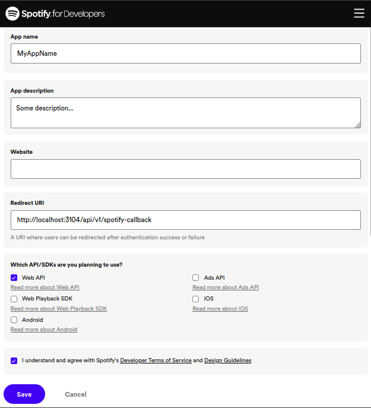
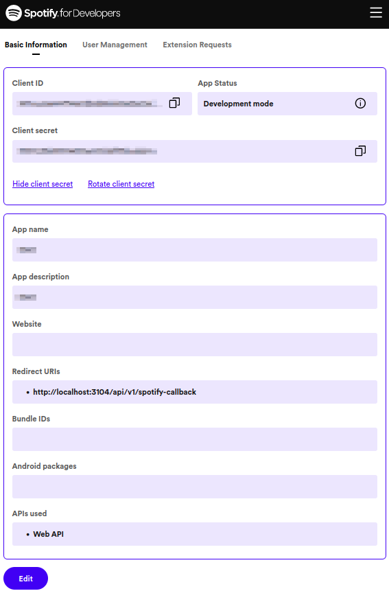

# Beats4Wled

## About
Note: This project is still in early beta and is far from perfect!  
I'm still trying to figure out why the animations aren't continuously smooth.  
If you know more than me, please share. :) I'm also open to Pull Requests!

This project's goal is to sync Spotify playback with WLED using the Spotify API.  

#### Advantages over AudioReactive/SoundReactive WLED:  
- No need for a microphone or line-in
- No need for any user mods

#### Advantages over LedFx:
- Way better beat-detection
- Audio is analyzed ahead of playback
- No need to play back the audio from or through your computer (It will work even if you play Spotify on your phone or on the other side of the world.)

## Prerequisites

- Get a Client ID and Client Secret from Spotify by creating a so called "app":  
    https://developer.spotify.com/dashboard/create
    
- Find your "app" in the dashboard: https://developer.spotify.com/dashboard and open it.
- Click on Settings (You will see your Client ID)
- Now click "View client secret" to get the Client Secret.
    
- It is assumed that you have WLED installed on an ESP and that your computer is in the same network and that you know the IP address or domain of the ESP.
- This project requires a recent version of Node.js to be installed on your computer.
- You might also want to install Git if you haven't already.

## Setup

Download the project and install the dependencies using `npm ci`. For example:
``` Bash
git clone http://github.com/T-vK/Beats4Wled.git
cd Beats4Wled
npm ci
```

In the directory where the `package.json` file is located, create a new file `config.json` with the following content:
``` JSON
{
    "spotify": {
        "clientId": "xxxxxxxxxxxxxxxxxxxxxxxxxxxxxxxxxx",
        "clientSecret": "xxxxxxxxxxxxxxxxxxxxxxxxxxxxxxxxxxxxxxx",
        "redirectUri": "http://localhost:3104/api/v1/spotify-callback",
        "playbackWatchInterval": 1000,
        "fps": 60,
        "audioDelay": 30
    },
    "wled": {
        "host": "192.168.X.X",
        "fps": 30,
        "updateProtocol": "udp"
    },
    "animation": {
        "speed": 60,
        "type": "beat"
    }
}
```
Make sure to set the values of your Spotify app for `clientId` & `clientSecret` and replace `192.168.X.X` witht he IP or domain name of your ESP.

## Usage

Run `npm run start` from the directory where the `package.json` is located.
As soon as you play music on Spotify account, it will make your WLED strip flash to the beat of the music.

## Configuration
There are a couple of different animation types at the moment. The recommended one is `beat`, but the following are available:
- segment (probably a bit overwhelming as it flashes every time the song changes significantly which might be several times per beat and a bit random)
- tatum (if you are looking for lower interval flashing that on beat)
- beat (recommended, flashes on beat)
- bar (a bit boring as it only flashes on every bar)
- segment (very boring as a song only consists of a handful of sections)

## Fine-tuning

It is likely that you will find your LEDs flashing a couple of milliseconds too early because some speakers have very noticable audio delay. For a Bluetooth speaker for example, you will have to increase the `audioDelay` in the `config.json`. Blueooth latency is typically 34-150 milliseconds. But the device running the Spotify app might also introcude an additional audio delay. For my Linux PC I found it be roughly 30ms.

The `updateProtocol` supports `udp` and `ws`. You might find the one working better than the other. 

You might also want to change the animation-`speed` for faster/slower fade outs and the wled-`fps` value (according to the docs 15-30 is recommended for `udp`.)

## Advanced

Feel free to change the code and create your own animations based on the audio analysis. 

## Future

This project is serving as a proof of concept for a new feature that could be integrated into WLED (as a usermod). The idea is to allow effects to use data from the Spotify API. For example:
- Name, artist(s), length of the playing song
- Current playback progress (seek bar position)
- Current playback status (paused/playing)
- Time signature (for the entire song that's playing and all sections of it)
- Key signature (including mode) (for the entire song that's playing and for all sections of it)
- Loudness/max loudness (including timing information) for the entire song that's playing and all the sections/segments of it
- Start and duration of the beats/bars/tatums/sections/segments of the playing song
- Timbre and musical pitch (as chroma vector) of the sections/segments of the playing song
- [Echo Nest Musical Fingerprint (ENMFP)](https://academiccommons.columbia.edu/doi/10.7916/D8Q248M4) codestring of the playing song
- [Synchstring](https://github.com/echonest/synchdata) and rhythmstring of the playing song
- Confidence data (like how confident was the algorithm that a specific beat was detected accurately or that the detected key of the song is accurate)

For more indepth information read through [this documentation](https://developer.spotify.com/documentation/web-api/reference/get-audio-analysis).

In order to accomplish that, the plan is as follows:
- Improve [spotify-api-arduino](https://github.com/witnessmenow/spotify-api-arduino) by adding support for the audio analysis endpoint
- Create a new usermod for WLED
    - Add config fields in the Web GUI for:
        - Spotify Client ID
        - Spotify Client Secret
        - Playback State update interval
    - Add an authorize button to the Web GUI (to retrieve the initial refresh token) which requires user interaction (loggin into spotify and allowing access)
    - In the backend:
        - Use [spotify-api-arduino](https://github.com/witnessmenow/spotify-api-arduino)
            - Query the Playback State at regular interval configured in the Web GUI
                - Parse the response stream, stripping out all the information that we don't require to save memory
                    - Query Audio Analysis every time the song changed
                    - Parse the response stream, stripping out all the information that we don't require to save memory
                    - Make the remaining audio analysis data available to the effects
                - Make the remaining playback state data available to the effects
        - Write example effects using the playback state and audio analysis data

I still ahve some research to in order to comply with the memory contraints, but I think https://arduinojson.org/ is going to be the solution.